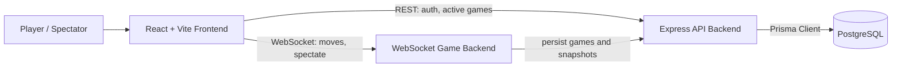

# Real-Time Multiplayer Chess

A full-stack chess application with authenticated gameplay, real-time WebSocket moves, live spectating, and persisted game state. The project is split into a React frontend, a WebSocket game server, and an Express/Prisma API for authentication and chess game persistence.

## Demo

🎮 **Live Demo:** [https://chess.visheshxdevs.in](https://chess.visheshxdevs.in)

### Screenshots

- **Home Screen**

  

- **Game Play**

  

## Features

- User registration, login, logout, and authenticated session checks
- Protected chess game route for signed-in players
- Real-time multiplayer move synchronization over WebSockets
- Spectator mode for viewing active games
- Active game listing and game detail lookup
- Move validation and board state management with `chess.js`
- Game persistence with PostgreSQL and Prisma models for users, games, moves, and board snapshots
- Game actions for resignation, draw requests, draw responses, invalid moves, and game-over events
- Basic health endpoints for backend services

## Tech Stack

- **Frontend:** React 19, TypeScript, Vite, React Router, Tailwind CSS
- **Game Engine:** `chess.js`
- **WebSocket Backend:** Node.js, TypeScript, `ws`, JWT
- **HTTP Backend:** Express 5, TypeScript, Prisma, PostgreSQL
- **Authentication:** JWT, bcryptjs
- **Tooling:** ESLint, TypeScript project builds, Vercel frontend config

## Architecture



## Project Structure

```text
chessGame/
|-- backend/                # WebSocket chess server
|   |-- src/
|   |   |-- controllers/    # WebSocket and health handlers
|   |   |-- db/             # Persistence API client
|   |   |-- middleware/     # JWT verification for sockets
|   |   |-- models/         # Game and game manager logic
|   |   |-- routes/         # HTTP and WebSocket route registration
|   |   |-- types/          # Shared backend types
|   |   `-- utils/          # Message constants
|   `-- package.json
|-- frontend/               # React client application
|   |-- public/             # Chess piece and page assets
|   |-- src/
|   |   |-- api/            # REST API clients
|   |   |-- auth/           # Auth context and client
|   |   |-- components/     # Reusable UI and game components
|   |   |-- hooks/          # WebSocket and sound hooks
|   |   `-- screens/        # App pages
|   `-- package.json
`-- https-backend/          # Express API, auth, and persistence service
    |-- prisma/
    |   `-- schema.prisma
    |-- src/
    |   |-- config/         # Environment config
    |   |-- controllers/    # Auth, game, and health controllers
    |   |-- db/             # Prisma client setup
    |   |-- middleware/     # HTTP auth middleware
    |   |-- routes/         # API routes
    |   |-- services/       # Auth, user, and chess persistence logic
    |   `-- types/          # API and domain types
    `-- package.json
```

## Installation

1. Clone the repository.

```bash
git clone <repository-url>
cd chessGame
```

2. Install dependencies for each app.

```bash
cd https-backend
npm install

cd ../backend
npm install

cd ../frontend
npm install
```

3. Configure environment variables.

```bash
cd ../https-backend
cp .env.example .env
```

Update the `.env` files for your local ports, JWT secret, API URLs, and database connection.

## Environment Variables

### `https-backend`

| Variable          | Description                                     | Default                 |
| ----------------- | ----------------------------------------------- | ----------------------- |
| `PORT`            | Port for the Express API server.                | `8000`                  |
| `FRONTEND_ORIGIN` | Allowed CORS origin for the React app.          | `http://localhost:5173` |
| `AUTH_JWT_SECRET` | Secret used to sign and verify JWT auth tokens. | Required for production |
| `DATABASE_URL`    | PostgreSQL connection string used by Prisma.    | Required                |

### `backend`

| Variable            | Description                                                               | Default                     |
| ------------------- | ------------------------------------------------------------------------- | --------------------------- |
| `PORT`              | Port for the WebSocket chess server.                                      | `8080`                      |
| `AUTH_JWT_SECRET`   | Secret used to verify player JWTs. Use the same value as `https-backend`. | `dev-only-secret-change-me` |
| `HTTPS_BACKEND_URL` | URL of the Express persistence API.                                       | `http://localhost:8000`     |

### `frontend`

| Variable                     | Description                                                       | Default                 |
| ---------------------------- | ----------------------------------------------------------------- | ----------------------- |
| `VITE_HTTPS_BACKEND_URL`     | Base URL for the Express API.                                     | `http://localhost:8000` |
| `VITE_WEBSOCKET_BACKEND_URL` | WebSocket URL for gameplay, usually `ws://localhost:8080/api/ws`. | Required                |

## Usage

Run the three services in separate terminals.

### Start the HTTP API

```bash
cd https-backend
npm run dev
```

The API runs on `http://localhost:8000` by default.

### Start the WebSocket Server

```bash
cd backend
npm run dev
```

The WebSocket server runs on `ws://localhost:8080/api/ws` by default. It also exposes:

- `ws://localhost:8080/api/ws/spectate?gameId=<game-id>`
- `ws://localhost:8080/api/ws/alive`

### Start the Frontend

```bash
cd frontend
npm run dev
```

The Vite app runs on `http://localhost:5173` by default.

## Example Output

Example response from `GET /api` on the HTTP backend:

```json
{
  "message": "Chess auth backend is running.",
  "endpoints": [
    "POST /api/auth/register",
    "POST /api/auth/login",
    "GET /api/auth/me",
    "POST /api/auth/logout",
    "GET /api/health",
    "GET /api/games/active"
  ]
}
```

Example WebSocket heartbeat from `/api/ws/alive`:

```json
{
  "type": "alive",
  "message": "I am alive",
  "timestamp": "2026-07-07T00:00:00.000Z"
}
```

## Configuration

- `frontend/vite.config.ts` configures the Vite React app.
- `frontend/vercel.json` contains deployment configuration for the frontend.
- `https-backend/prisma/schema.prisma` defines the PostgreSQL data model.
- `https-backend/.env.example` provides a starter environment file for the HTTP API.
- Runtime URLs are configured through environment variables, so local and deployed services can point to different API and WebSocket hosts.

## APIs & External Services

### HTTP API

- `GET /api`
- `GET /api/health`
- `POST /api/auth/register`
- `POST /api/auth/login`
- `GET /api/auth/me`
- `POST /api/auth/logout`
- `GET /api/games/active`
- `GET /api/games/active/game/:gameId`
- `GET /api/games/active/:userId`
- `POST /api/games`
- `POST /api/games/:gameId/snapshots`
- `POST /api/games/:gameId/finish`

### WebSocket Endpoints

- `/api/ws` for authenticated gameplay
- `/api/ws/spectate?gameId=<game-id>` for live spectators
- `/api/ws/alive` for heartbeat checks

### External Services

- PostgreSQL database for persisted users, chess games, moves, and board snapshots
- Vercel-compatible frontend deployment configuration

## Roadmap / Future Improvements

- [ ] Add automated tests for gameplay, auth, and persistence flows
- [ ] Add CI checks for linting and builds
- [ ] Add production deployment documentation
- [ ] Add screenshots or a hosted demo link
- [ ] Add player profiles and match history
- [ ] Add time controls and game clocks

## Contributing

Contributions are welcome. Fork the repository, create a feature branch, make a focused change, and open a pull request with a clear description of what changed and how it was tested.

Before submitting, run the relevant checks:

```bash
cd frontend && npm run lint && npm run build
cd ../backend && npm run build
cd ../https-backend && npm run build
```

## License

This project is licensed under the ISC License.

## Author

Author information is not currently included in the repository.

## Acknowledgements

- [`chess.js`](https://github.com/jhlywa/chess.js) for chess move validation and game state helpers
- React, Vite, Express, Prisma, PostgreSQL, and the open-source JavaScript ecosystem
