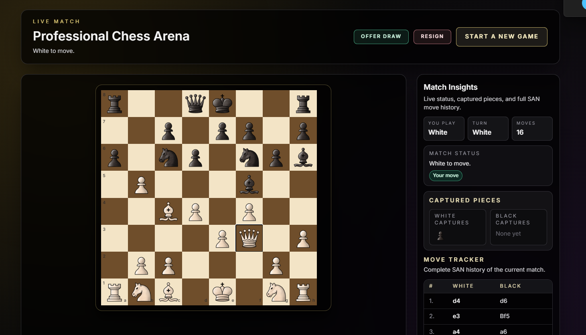
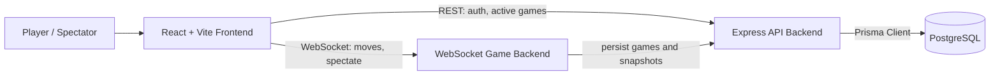

# Real-Time Multiplayer Chess

A full-stack chess web app with authenticated gameplay, real-time WebSocket move synchronization, live spectating, and persisted game state. The project is split into a React frontend, a WebSocket game server, and an Express/Prisma API for authentication and chess game persistence — with Docker Compose and Kubernetes deployment support.

## Demo

🎮 **Live Demo:** [https://chess.visheshxdevs.in](https://chess.visheshxdevs.in)

### Screenshots

- **Home Screen**

  

- **Game Play**

  

## Features

- User registration, login, logout, and authenticated session checks
- Protected chess game route for signed-in players
- Real-time multiplayer move synchronization over WebSockets
- Spectator mode for viewing active games
- Active game listing and game detail lookup
- Move validation and board state management with `chess.js`
- Game persistence with PostgreSQL and Prisma models for users, games, moves, and board snapshots
- Game actions for resignation, draw requests, draw responses, invalid moves, and game-over events
- Move sound effects during gameplay
- Basic health endpoints for backend services
- Containerized local development with hot reload (`docker-compose.dev.yml`)
- Production Docker Compose stack with an nginx-served frontend
- Kubernetes manifests and a GitHub Actions CI pipeline

## Tech Stack

- **Frontend:** React 19, TypeScript, Vite, React Router, Tailwind CSS
- **Game Engine:** `chess.js`
- **WebSocket Backend:** Node.js, TypeScript, `ws`, JWT
- **HTTP Backend:** Express 5, TypeScript, Prisma, PostgreSQL
- **Authentication:** JWT, bcryptjs
- **Database:** PostgreSQL 16
- **DevOps:** Docker, Docker Compose, Kubernetes, GitHub Actions, GHCR

## Architecture



The `backend` (WebSocket) and `https-backend` (API) are separate processes that share the same `AUTH_JWT_SECRET` for verifying player tokens.

## Project Structure

```text
chessGame/
├── frontend/                 # React client application
│   ├── public/               # Chess piece assets, sounds, screenshots
│   └── src/
│       ├── api/              # REST API clients
│       ├── auth/             # Auth context and client
│       ├── components/       # Reusable UI and game components
│       ├── hooks/            # WebSocket and sound hooks
│       └── screens/          # App pages (Landing, Game, Spectate, Auth)
├── backend/                  # WebSocket chess server
│   └── src/
│       ├── controllers/      # WebSocket and health handlers
│       ├── db/               # Persistence API client
│       ├── middleware/       # JWT verification for sockets
│       ├── models/           # Game and game manager logic
│       ├── routes/           # HTTP and WebSocket route registration
│       ├── types/            # Shared backend types
│       └── utils/            # Message constants
├── https-backend/            # Express API, auth, and persistence service
│   ├── prisma/
│   │   └── schema.prisma     # PostgreSQL data model
│   └── src/
│       ├── config/           # Environment config
│       ├── controllers/      # Auth, game, and health controllers
│       ├── db/               # Prisma client setup
│       ├── middleware/       # HTTP auth middleware
│       ├── routes/           # API routes
│       ├── services/         # Auth, user, and chess persistence logic
│       └── types/            # API and domain types
├── kubernetes/               # K8s manifests (namespace, ingress, deployments, Postgres)
├── .github/workflows/        # CI pipeline
├── docker-compose.yml        # Production-mode stack
├── docker-compose.dev.yml    # Dev stack with hot reload
├── DEPLOYMENT.md             # Full deployment runbook
└── .env.example              # Root environment template
```

## Installation

### Option 1 — Local development (from source)

1. Clone the repository.

```bash
git clone <repository-url>
cd chessGame
```

2. Install dependencies for each app.

```bash
cd https-backend
npm install

cd ../backend
npm install

cd ../frontend
npm install
```

3. Configure environment variables.

```bash
cd ../https-backend
cp .env.example .env
```

Update the `.env` files for your local ports, JWT secret, API URLs, and database connection.

4. Sync the database schema (no migration files exist yet — `db push` syncs the schema).

```bash
cd ../https-backend
npx prisma db push
```

### Option 2 — Docker Compose (full local stack)

```bash
cp .env.example .env        # adjust AUTH_JWT_SECRET, URLs
docker compose up --build   # starts db, migrate, https-backend, backend, frontend
```

- Frontend: http://localhost:3000 (nginx serving the built SPA)
- HTTP API: http://localhost:8000/api/health
- WebSocket: ws://localhost:8080/api/ws

### Option 3 — Docker Compose (dev with hot reload)

```bash
docker compose -f docker-compose.dev.yml up   # db, migrate, API, WS server, Vite UI
```

The dev stack bind-mounts source code, uses polling watchers for reliable restarts on Docker Desktop for Windows, and serves the Vite UI at http://localhost:5173.

## Environment Variables

### Root (`.env`) — used by Docker Compose

| Variable | Description | Default |
|---|---|---|
| `AUTH_JWT_SECRET` | Shared JWT secret (must match across both Node services) | `dev-only-secret-change-me` |
| `FRONTEND_ORIGIN` | CORS origin allowed by the HTTP API | `http://localhost:3000` |
| `VITE_HTTPS_BACKEND_URL` | API URL baked into the frontend build | `http://localhost:8000` |
| `VITE_WEBSOCKET_BACKEND_URL` | WebSocket URL baked into the frontend build | `ws://localhost:8080/api/ws` |

### `https-backend/.env`

| Variable | Description | Default |
|---|---|---|
| `PORT` | Port for the Express API server. | `8000` |
| `FRONTEND_ORIGIN` | Allowed CORS origin for the React app. | `http://localhost:5173` |
| `AUTH_JWT_SECRET` | Secret used to sign and verify JWT auth tokens. | Required for production |
| `DATABASE_URL` | PostgreSQL connection string used by Prisma. | Required |

### `backend/.env`

| Variable | Description | Default |
|---|---|---|
| `PORT` | Port for the WebSocket chess server. | `8080` |
| `AUTH_JWT_SECRET` | Secret used to verify player JWTs. Use the same value as `https-backend`. | `dev-only-secret-change-me` |
| `HTTPS_BACKEND_URL` | URL of the Express persistence API. | `http://localhost:8000` |

### `frontend/.env`

| Variable | Description | Default |
|---|---|---|
| `VITE_HTTPS_BACKEND_URL` | Base URL for the Express API. | `http://localhost:8000` |
| `VITE_WEBSOCKET_BACKEND_URL` | WebSocket URL for gameplay, usually `ws://localhost:8080/api/ws`. | Required |

> Note: `VITE_*` values are baked into the frontend bundle at **build time** — changing them requires a rebuild.

## Usage

Run the three services in separate terminals.

### Start the HTTP API

```bash
cd https-backend
npm run dev
```

The API runs on `http://localhost:8000` by default.

### Start the WebSocket Server

```bash
cd backend
npm run dev
```

The WebSocket server runs on `ws://localhost:8080/api/ws` by default. It also exposes:

- `ws://localhost:8080/api/ws/spectate?gameId=<game-id>`
- `ws://localhost:8080/api/ws/alive`

### Start the Frontend

```bash
cd frontend
npm run dev
```

The Vite app runs on `http://localhost:5173` by default. Register an account, log in, and start or join a game.

## Automation

### CI (GitHub Actions)

`.github/workflows/ci.yml` runs on push/PR to `main`:

- **https-backend:** `npm ci`, `prisma generate`, `npm run build`
- **backend:** `npm ci`, `npm run build`
- **frontend:** `npm ci`, `npm run lint`, `npm run build`

### Database migrations

Schema sync is handled automatically in Docker Compose by a `migrate` one-shot service that runs `prisma db push` before the API starts. In Kubernetes, a `prisma-migrate-job.yml` Job applies the schema after Postgres is up.

### Kubernetes deployment

The `kubernetes/` directory contains manifests for a full cluster deployment:

```
kubernetes/
├── namespace.yml
├── ingress.yml               # routes /api/ws → WS server, /api → API, / → frontend
├── backend/                  # deployment, service, config, secret
├── https-backend/            # deployment, service, config, secret
├── frontend/                 # deployment, service
└── infra/                    # postgres statefulset, service, prisma migrate job
```

See [DEPLOYMENT.md](DEPLOYMENT.md) for the complete runbook covering Docker images, Kubernetes rollout/rollback, and the CI/CD workflow.

## Example Output

Example response from `GET /api` on the HTTP backend:

```json
{
  "message": "Chess auth backend is running.",
  "endpoints": [
    "POST /api/auth/register",
    "POST /api/auth/login",
    "GET /api/auth/me",
    "POST /api/auth/logout",
    "GET /api/health",
    "GET /api/games/active"
  ]
}
```

Example WebSocket heartbeat from `/api/ws/alive`:

```json
{
  "type": "alive",
  "message": "I am alive",
  "timestamp": "2026-07-07T00:00:00.000Z"
}
```

## Configuration

- `frontend/vite.config.ts` configures the Vite React app.
- `frontend/vercel.json` contains deployment configuration for the frontend.
- `https-backend/prisma/schema.prisma` defines the PostgreSQL data model.
- `docker-compose.yml` / `docker-compose.dev.yml` define the production-mode and hot-reload stacks (Postgres on port `5433`, API on `8000`, WS on `8080`).
- `kubernetes/ingress.yml` routes `/api/ws` (with WebSocket upgrade support) and `/api` to the respective backends.
- Runtime URLs are configured through environment variables, so local and deployed services can point to different API and WebSocket hosts.

## APIs & External Services

### HTTP API

- `GET /api`
- `GET /api/health`
- `POST /api/auth/register`
- `POST /api/auth/login`
- `GET /api/auth/me`
- `POST /api/auth/logout`
- `GET /api/games/active`
- `GET /api/games/active/game/:gameId`
- `GET /api/games/active/:userId`
- `POST /api/games`
- `POST /api/games/:gameId/snapshots`
- `POST /api/games/:gameId/finish`

### WebSocket Endpoints

- `/api/ws` for authenticated gameplay
- `/api/ws/spectate?gameId=<game-id>` for live spectators
- `/api/ws/alive` for heartbeat checks

### External Services

- PostgreSQL — persistent storage for users, chess games, moves, and board snapshots
- GHCR — container images for the backend services
- Vercel-compatible frontend deployment configuration

## Roadmap / Future Improvements

- [ ] Add automated tests for gameplay, auth, and persistence flows
- [ ] Add a CD workflow for automated image builds and deployments
- [ ] Add player profiles and match history
- [ ] Add time controls and game clocks
- [ ] Add real Prisma migration files (`prisma migrate deploy` instead of `db push`)
- [ ] Improve accessibility

## Contributing

Contributions are welcome. Fork the repository, create a feature branch, make a focused change, and open a pull request with a clear description of what changed and how it was tested.

Before submitting, run the relevant checks:

```bash
cd frontend && npm run lint && npm run build
cd ../backend && npm run build
cd ../https-backend && npm run build
```

## License

This project is licensed under the ISC License.

## Author

**Vishesh Verma** (@vishesh-verma-07)

## Acknowledgements

- [`chess.js`](https://github.com/jhlywa/chess.js) for chess move validation and game state helpers
- React, Vite, Express, Prisma, PostgreSQL, and the open-source JavaScript ecosystem